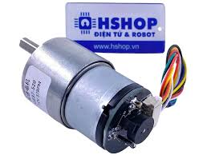
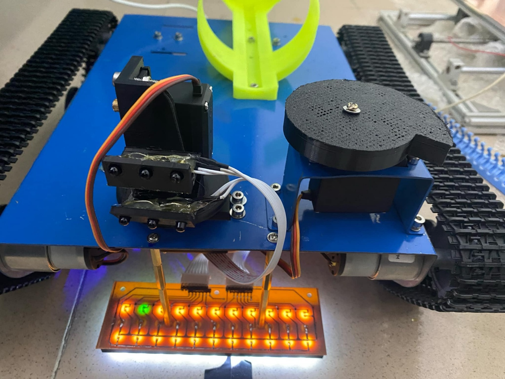

1. **Sơ đồ/bản vẽ thiết kế sơ bộ/ chi tiết:**  
- Bản vẽ 3D cơ khí (solid work)  
- Bản vẽ mạch điện (Altium)  
- Sơ đồ mô phỏng nhà(Map)  
2. **Thiết kế từng bộ phận:**

**2.1 Thiết kế robot chữa cháy**

1) Phần bánh xe

Phần bánh xe Phần bánh xe của robot sử dụng bánh xe dây đai, tương tự như bánh xe tăng, giúp tăng độ ma sát và khả năng bám đường. Cấu trúc này cho phép robot di chuyển trên nhiều loại bần mặt với độ ốn định cao. Bánh xe dây đai còn hạn chế hiện tượng trượt khi robot phải di chuyển qua các khu vực bất đồng hoặc góc nghiêng.

Động cơ sử dụng là động cơ JGB37 có encoder để điều khiển chính xác tốc độ động cơ

2) Khung xe

Khung xe Khung xe được thiết kế và vẽ 3D, sau đó gia công cắt CNC từ vật liệu thép để đảm bảo độ bền và khả năng chịu nhiệt cao. Thiết kế này giúp khung xe có độ chính xác cao và dễ dàng lắp ráp các bộ phận khác như cảm biến, camera và hệ thống xịt cứu hoả.

3) Dò đường

Robot được trang bị cảm biến dò line để theo dõi các vạch line dẫn đường. Hệ thống cảm biến này giúp robot di chuyển chính xác theo tuyến đường định sẵn, đảm bảo đến đúng vị trí cần chữa cháy một cách nhanh chóng và hiệu quả.

4) Cơ cấu xịt cứu hoả

Robot sử dụng bình cứu hoả có thể thay thế dễ dàng, thuận tiện trong quá trình vận hành. Hệ thống được thiết kế để giữ bình cứu hoả chắc chắn trong khi robot di chuyển và kích hoạt phun khi cần thiết, đảm bảo khả năng chữa cháy nhanh và hiệu quả.

5) Cơ cấu nhận diện/detect lửa

Camera AI được tích hợp trên robot giúp nhận diện ngọn lửa thông qua hình ảnh và nhiệt độ. Ngoài ra, robot còn trang bị cảm biến lửa (flame sensor) để tăng độ chính xác khi phát hiện nguồn cháy. Camera AI xử lý dữ liệu theo thời gian thực và điều hướng robot đến vị trí cần xử lý.

6) Còi báo động

Robot được trang bị còi báo động cường độ cao để cảnh báo khi phát hiện nguồn cháy. Còi này cũng hoạt động như một biện pháp báo hiệu an toàn cho những người xung quanh biết vị trí của robot khi nó đang hoạt động.

7) Truyền thông

Robot sử dụng giao thức ESP-NOW để truyền thông không dây với các cảm biến trong toà nhà. Giao thức này giúp truyền dữ liệu nhanh chóng và ổn định, đảm bảo thông tin về vị trí nguồn cháy được cập nhật chính xác cho robot.

8) Mạch điều khiển trung tâm

Mạch điều khiển chính được vẽ bằng phần mềm, sau đó gia công ăn mòn mạch đồng, tăng tính thẩm mỹ và gọn nhẹ. Với vi điều khiển chính là esp32 với tốc độ xử lý cao và hỗ trợ nhiều chân INPUT OUTPUT.

9) Nguồn

Nguồn cho robot được ghép từ 9 viên pin 18650 với điện áp đầu ra lên tới 12V cung cấp cho toàn bộ robot. 

2. **Thiết kế mạng cảm biến báo cháy toà nhà**  
1) Truyền thông giao tiếp

Mạng cảm biến sử dụng giao thức ESP-NOW để kết nối không dây giữa các cảm biến và robot chữa cháy. Hệ thống truyền thông này có khả năng hoạt động trong môi trường có nhiều nhiễu, đảm bảo tín hiệu được truyền đến robot trong thời gian ngắn nhất.

Giao tiếp ESP NOW có thể truyền xa tới 400m trong môi trường không có vật cản

2) Cảm biến khói, lửa

Mỗi phòng trong toà nhà được trang bị cảm biến khói (smoke sensor) và cảm biến lửa (flame sensor). Cảm biến khói phát hiện nồng độ khí CO và các hạt bụi mịn trong không khí, trong khi cảm biến lửa nhận diện ánh sáng phát ra từ ngọn lửa. Khi có cháy, các cảm biến sẽ gửi tín hiệu đến robot và kích hoạt hệ thống cảnh báo.

3) Còi

Mỗi khu vực được trang bị còi báo động riêng. Khi cảm biến phát hiện lửa hoặc khói, còi sẽ kích hoạt để cảnh báo mọi người sơ tán khỏi khu vực nguy hiểm.

4) Cơ chế tắt cầu giao nguồn điện tổng

Hệ thống cảm biến được tích hợp với relay để điều khiển cầu giao nguồn điện tổng. Khi phát hiện cháy, relay sẽ ngắt nguồn điện ở khu vực bị ảnh hưởng để giảm nguy cơ cháy lan do chập điện.

3. **Thuyết minh chi tiết chung toàn bộ công dụng robot**

*Công dụng 1: Báo động toà nhà khi xảy ra cháy nổ*

Robot được trang bị hệ thống còi báo động có thể phát âm thanh lớn để cảnh báo cư dân trong toà nhà về sự cố cháy nổ. Cùng với đó, các tín hiệu cảnh báo có thể được gửi đến trung tâm điều khiển để kích hoạt hệ thống cứu hoả hoặc thông báo cho nhân viên an ninh.

*Công dụng 2: Robot tự động tắt nguồn điện tổng*

Khi xảy ra cháy, robot sẽ kích hoạt hệ thống tắt nguồn điện tổng thông qua điều khiển relay, giúp giảm nguy cơ chập điện hoặc các vụ nổ thứ cấp. Chức năng này đảm bảo an toàn cho cả người và thiết bị trong toà nhà, đồng thời tạo điều kiện thuận lợi cho công tác chữa cháy.

*Công dụng 3: Robot xác định vị trí cháy và tự đến nơi để dập tắt đám cháy, sau đó tự đi về vị trí ban đầu*

Robot sử dụng các cảm biến dò lửa và khói kết hợp với camera để xác định chính xác vị trí xảy ra cháy. Sau khi xác định được vị trí, robot di chuyển theo tuyến đường tối ưu đến hiện trường và kích hoạt hệ thống xịt cứu hoả. Sau khi hoàn thành nhiệm vụ, robot tự động quay về vị trí ban đầu để sẵn sàng cho nhiệm vụ tiếp theo, đảm bảo khả năng hoạt động liên tục và hiệu quả.

4. **Hình ảnh lắp ráp từng giai đoạn/ bộ phận của robot**  
5. **Sai sót trong quá trình lắp ráp robot**  
- Động cơ yếu: Khối lượng robot vào khoảng 10kg, do đó phải thay đổi cơ cấu từ 2 động cơ lên 4 động cơ  
- Khung robot: Tính toán sai kích thước nên phải đi gia công lại khung robot nhiều lần, ban đầu dùng mica nhưng bị gãy không tải được robot.

*Khung cũ thiết kế thiếu cơ chế xịt*

-   
6. **Thành phần đội nhóm tham gia, vai trò từng thành viên**

| Họ và Tên | A | B |
| ----- | ----- | ----- |
| Thông tin  | Sinh viên năm Khoa: Trường: | Sinh viên năm Khoa: Trường: |
| Vai trò | \- Thiết kế 3D cơ khí từ bản phác thảo \- Đo đạc thông số linh kiện \- Gia công và lắp đặt robot \- Lựa chọn linh kiện | \-Thiết kế mạch cho robot \- Test cảm biến, động cơ \- Code cho robot (mạch phần cứng, xử lý ảnh nhận diện lửa…) |

7. **Khả năng mở rộng, cải tiến trong tương lai**  
* Tích hợp với hệ thống báo cháy toà nhà  
* Robot có thể leo cầu thang, di chuyển giữa các tầng  
* Gửi tín hiệu qua tin nhắn SMS cảnh báo tới người dùng  
* Trợ lý ảo giám sát toà nhà  
    
8. **Bản code sau khi hoàn thiện**

